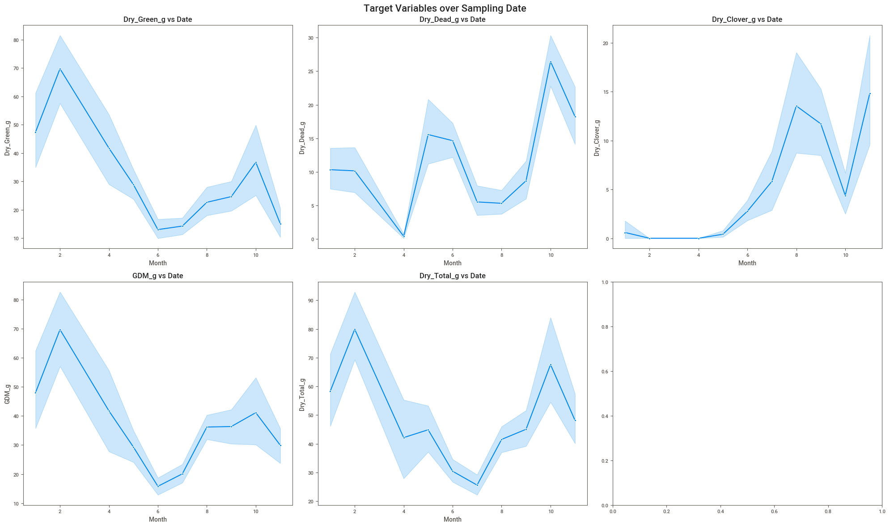
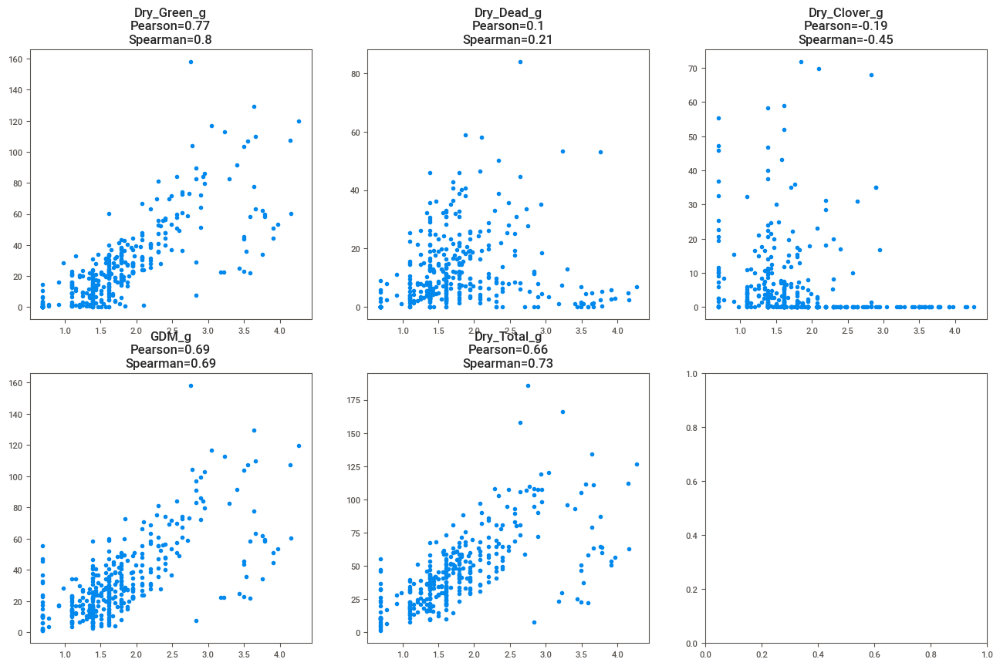
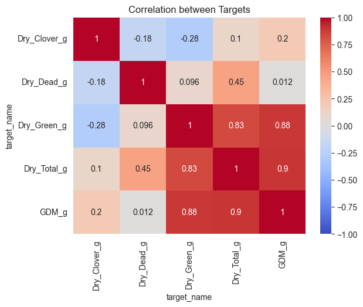
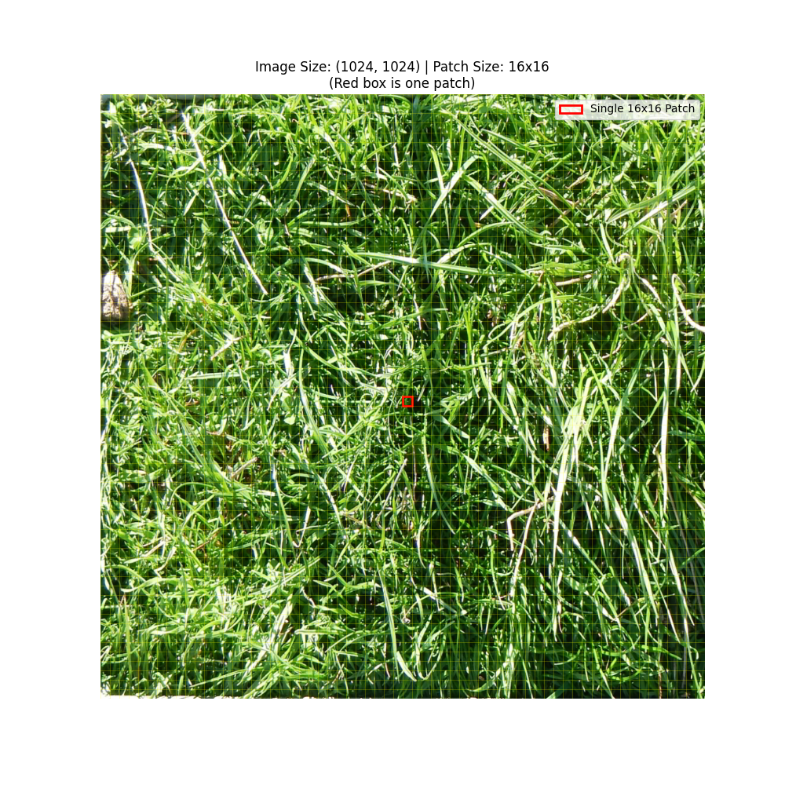
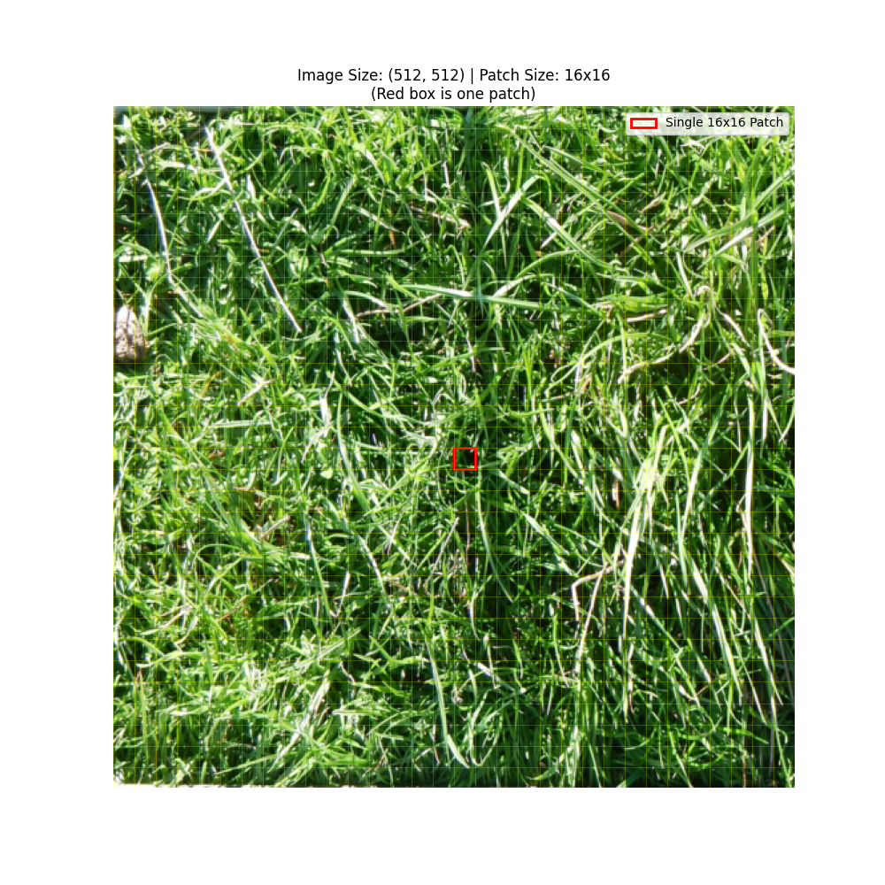
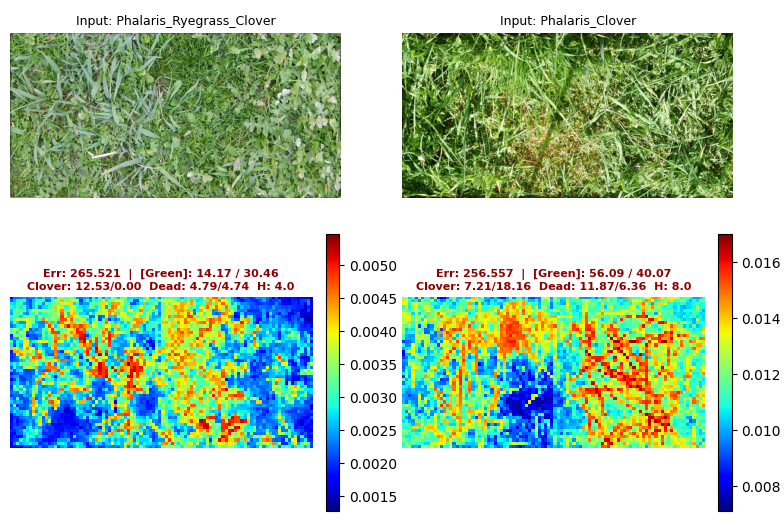
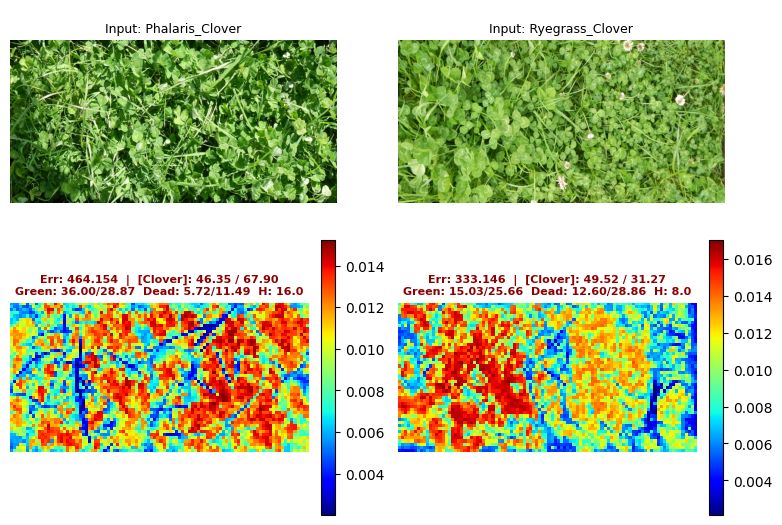
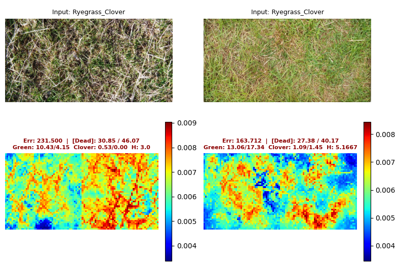

# CSIRO - Image2Biomass Prediction 
## Intro
This repository contains my solutions, experiments, and modeling pipelines for the Kaggle [CSIRO - Image2Biomass Prediction](https://www.kaggle.com/competitions/csiro-biomass/overview) competition. The objective of this competition is to predict the dry biomass of different pasture components (Green, Clover, Dead, Total, and GDM) from field images.

Below is a summary of the techniques, architectures, and data processing steps I explored and implemented during the competition.

## Data Analysis & Preprocessing
Extensive data exploration and preprocessing were critical for handling the noisy and high-resolution nature of the field images.

### Exploratory Data Analysis
Conducted thorough EDA on the main CSIRO dataset ([CSIRO_analysis.ipynb](analysis/CSIRO_analysis.ipynb)) as well as external datasets to understand the target variables' distribution. Furthermore, I also explored the relationship between the target variable and other features, such as date and species, which was crucial for determining the optimal strategy for splitting the dataset for local cross-validation.

<table>
 <tr>
    <td align="center" colspan="2">
     <b>Target vs. Sampling Date</b> 
    
    </td>
 </tr>
 <tr>
  <td align="center">
   <b>Target vs. Height</b> 
   
  </td>
  <td align="center">
   <b>Correlation Matrix</b> 
   
  </td>
 </tr>
</table>

### Polluted Image Filtering
Analyzed the dataset to identify "polluted" or highly anomalous images. Created a hardcoded filter to exclude these specific problematic images (e.g., images missing dead material but labeled otherwise) from the training dataset.

## Model Architectures
I experimented with several vision transformer-based architectures, primarily utilizing the **DinoV3 ViT** backbone, progressively adding complexity to improve spatial reasoning.

### Baseline Model
A straightforward pipeline using a frozen DinoV3 backbone followed by a patch-wise Multi-Layer Perceptron (MLP) head to predict biomass values directly. The final biomass prediction is generated by aggregating (summing) the patch-wise predictions across the image.

### Improvement
- **Image Splitting Strategy**: To efficiently process the wide aspect ratio of the input images (originally 1000 x 2100) without losing critical resolution, I split each image into distinct left and right halves. This strategy not only handled the resolution limits but effectively doubled the number of training samples, significantly increasing data variability and model robustness.

- **Multi-Scale Inputs**: The model ingests both high-resolution and low-resolution patches of the images simultaneously to capture both fine-grained leaf textures and global spatial context. The low-res feature map is then upsampled and concat with high-res feature map.
  <table>
  <tr>
    <td align="center">
    <b>High-Res</b> 
    
    </td>
    <td align="center">
    <b>Low-Res</b> 
    
    </td>
  </tr>
  </table>

- **Gating**: For targets such as Dry_Dead and Dry_Clover which are Zero-Inflated Distributed, it's necessary to suppress patches' prediction to exactly zero. This is done by generating a patch-wise floating mask which then multiplied with patch-wise bio prediction, effectly suppress the values that should be zero.

## Training Pipeline
- **Huber Loss**: Huber loss is adopted to suppress the effect of outliers
- **Two-Stage Training**: The backbone DinoV3-ViT is initially frozen to prevent degenerating backbone's weights, and subsequently unfreeze to learn the bio specific fine-grained features.

## Result
Public Ranking: 873/3804
Private Ranking: 979/3804 (**top 25%**)
### Sample Prediction
#### Dry_Green Prediction

#### Dry_Clover Prediction

#### Dry_Dead Prediction

## Other Experiments
### External Dataset
To inject more domain knowledge and improve the model's robustness, I incorporated external datasets into the training pipeline.
* **Data Integration:** Utilized external "Irish" and "GrassClover" datasets. 
* **Image Rectification:** Wrote custom OpenCV scripts to preprocess the external data, specifically using contour detection and minimum area bounding rectangles to rectify arbitrarily rotated images back to axis-aligned orientations.
* **Two-Stage Training:** Employed a two-stage training curriculum. The model was initially pre-trained on the combined external datasets to learn fundamental grassy/clover features, and subsequently fine-tuned on the primary CSIRO dataset to align with the specific competition metrics.

The two external dataset didn't help increase the model's performance due to their insufficient variability compared to CSIRO dataset.

### Pseudo-Gating & Manual Patch-Wise Segmentation
One of the core challenges was helping the model understand *where* the specific biomass (especially sparse components like Clover or Dead grass) was located. 
* **Interactive Visualization Tool:** I developed a custom interactive OpenCV graphical interface (`visualize_gates.py`) to manually inspect the model's raw patch-wise predictions.
* **Manual Mask Creation:** Using this tool, I manually painted over the patch grids to create ground-truth binary segmentation masks (pseudo-gates) for Green, Clover, and Dead regions.
* **Guided Learning:** These pseudo-masks were saved to disk and loaded dynamically by the `CSIRODataset` during training. They act as a strong spatial prior, either directly supervising the patch-level outputs or acting as a gating mechanism to suppress noise in regions where a specific biomass type is entirely absent.

### Log Transformation
I tried log-transforming the target biomass values to handle skewed distributions and stabilize training gradients, but it did not improve the final performance.

### Parameter-Efficient Fine-Tuning (LoRA)
I attempted to integrate LoRA (Low-Rank Adaptation) on the q_proj and v_proj attention matrices to fine-tune the heavy DinoV3 backbone efficiently. However, this did not yield better results than fine-tuning the whole backbone.